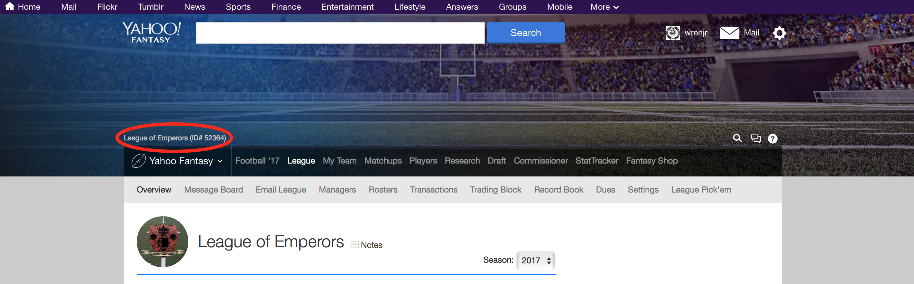
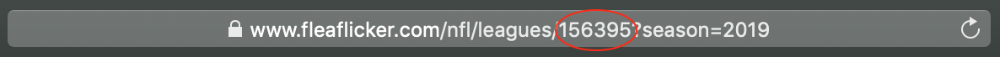
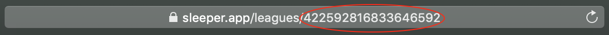
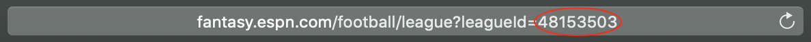
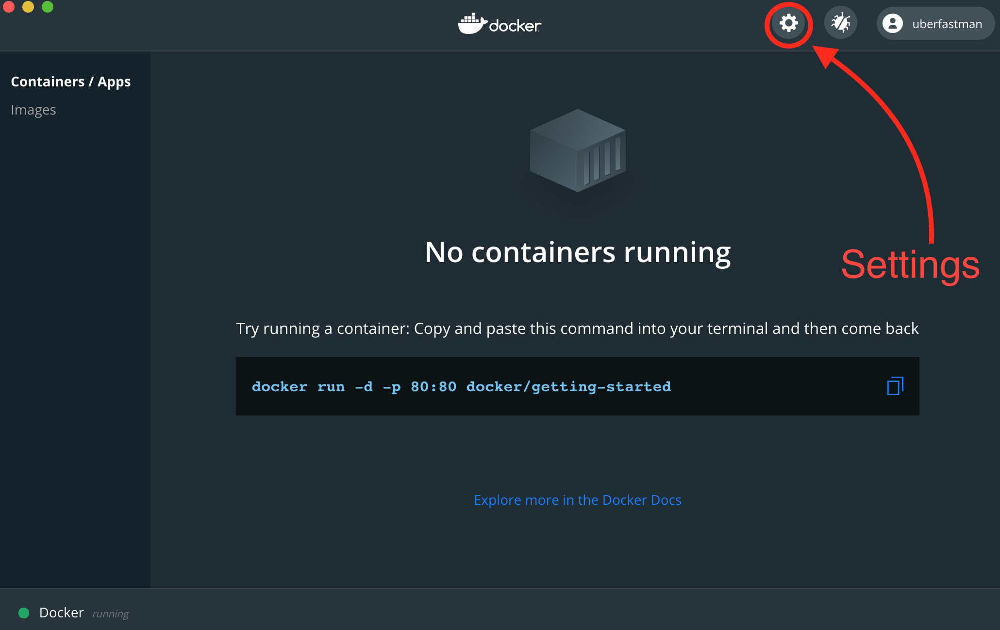
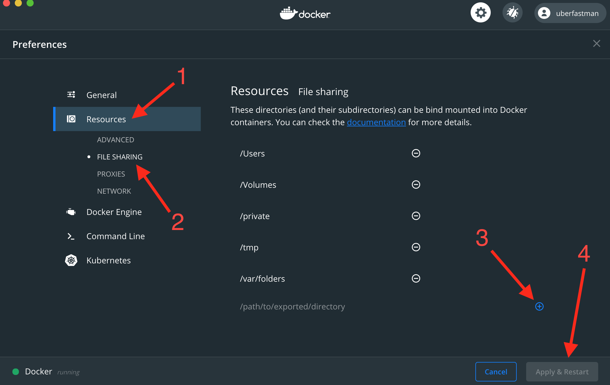

# Fantasy Football Metrics Weekly Report [](https://github.com/uberfastman/fantasy-football-metrics-weekly-report/stargazers) [](https://github.com/uberfastman/fantasy-football-metrics-weekly-report/network/members)

[](https://travis-ci.com/uberfastman/fantasy-football-metrics-weekly-report)
[](https://github.com/uberfastman/fantasy-football-metrics-weekly-report/blob/main/LICENSE)

---

[](https://github.com/uberfastman/fantasy-football-metrics-weekly-report/releases/latest)
[](https://github.com/uberfastman/fantasy-football-metrics-weekly-report/releases/latest)
[](https://github.com/uberfastman/fantasy-football-metrics-weekly-report/tags)
[](https://github.com/uberfastman/fantasy-football-metrics-weekly-report/commits/main)

---

[](https://github.com/uberfastman/fantasy-football-metrics-weekly-report/issues)
[](https://github.com/uberfastman/fantasy-football-metrics-weekly-report/pulls)

[](https://github.com/uberfastman/fantasy-football-metrics-weekly-report/milestones)
<sup>➡️</sup>
[](https://github.com/uberfastman/fantasy-football-metrics-weekly-report/milestone/3)
[](https://github.com/uberfastman/fantasy-football-metrics-weekly-report/milestone/2)
[](https://github.com/uberfastman/fantasy-football-metrics-weekly-report/milestone/4) 
[](https://github.com/uberfastman/fantasy-football-metrics-weekly-report/milestone/5)

[](https://github.com/uberfastman/fantasy-football-metrics-weekly-report/milestones?state=closed)
<sup>➡️</sup>
[](https://github.com/uberfastman/fantasy-football-metrics-weekly-report/milestone/1)

---

#### Fantasy Football Platform Support: [Yahoo](#yahoo-setup), [ESPN](#espn-setup), [Sleeper](#sleeper-setup), [Fleaflicker](#fleaflicker-setup)

***You can see an example of what a report looks like [here](resources/files/EXAMPLE-report.pdf)!***

---

###### Do you like the app? Star the repository here on GitHub and please consider donating to help support its development:

| <sub>PayPal/CC</sub> | <sub>Bitcoin (BTC)</sub> | <sub>Ethereum (ETH)</sub> | <sub>Nano (NANO)</sub> |
| :---: | :---: | :---: | :---: |
| [](https://www.paypal.com/cgi-bin/webscr?cmd=_donations&business=VZZCNLRHH9BQS) | [](https://share.trustwallet.com/ZoAkTpY1I9) | [](https://share.trustwallet.com/MF8YBO01I9) | [](https://share.trustwallet.com/bNXsMA11I9) |

<sub>BTC: `bc1qataspvklhewtswm357m0677q4raag5new2xt3e`</sub>

<sub>ETH: `0x5eAa522e66a90577D49e9E72f253EC952CDB4059`</sub>

<sub>NANO: `nano_3ug3o6yy983jsqdsc773izhr3jfz4dq8bz7yfhhzkkeq7s8ern1ws7dng4pq`</sub>

---

###### Interested in contributing? <sub><sub>[](resources/documentation/README.md)</sub></sub>

---

### Table of Contents
* <ins>***[Quickstart Guide](#quickstart-guide)***</ins>
* [About](#about)
    * [Example Report](#example-report)
    * [Updating](#updating)
* [Dependencies](#dependencies)
* [Setup](#setup)
    * [Command-line](#command-line)
    * [Git](#git)
    * [Docker](#docker)
    * [GitHub](#github)
    * [Yahoo Setup](#yahoo-setup)
    * [Fleaflicker Setup](#fleaflicker-setup)
    * [Sleeper Setup](#sleeper-setup)
    * [ESPN Setup](#espn-setup)
* [Running the Report Application](#running-the-report-application)
* [Configuration](#configuration)
   * [Report Features](#report-features)
   * [Report Formatting](#report-formatting)
   * [Report Settings](#report-settings)
* [Usage](#usage)
* [Additional Integrations](#additional-integrations)
    * [Google Drive](#google-drive-setup)
    * [Slack](#slack-setup)
* [Troubleshooting](#troubleshooting)
    * [Logs](#logs)
    * [Yahoo](#yahoo)
    * [Docker on Windows](#docker-on-windows)

---

<a name="quickstart-guide"></a>
## *Quickstart Guide*

```diff
+ NEW (AND EASIER) APPLICATION SETUP BELOW!
```

1. Open a command-line interface (see the [Command-line](#command-line) section for more details) on your computer.

    * ***macOS***: type `Cmd + Space` (`⌘ + Space`) to bring up Spotlight, and search for "Terminal" and hit enter).
    
    * ***Windows***: type `Windows + R` to open the "Run" box, then type `cmd` and then click "OK" to open a regular Command Prompt (or type `cmd` and then press `Ctrl + Shift + Enter` to open a Command Prompt as administrator.)
    
    * ***Linux (Ubuntu)***: type `Ctrl+Alt+T`.

2. Install Git (see [Git](#git) section for more details.

    * ***macOS***: run `git --version` for the first time, and when prompted, install the *Xcode Command Line Tools*.
    
    * ***Windows***: Download [Git for Windows](https://git-scm.com/download/win) and install it.
    
    * ***Linux (Ubuntu)***: `sudo apt install git-all` (see above link for different Linux distributions)

3. Install [Docker Desktop](#docker) for your operating system.

    * ***macOS***: [Docker Desktop for Mac](https://docs.docker.com/docker-for-mac/install/)
    
    * ***Windows***: [Docker Desktop for Windows](https://docs.docker.com/docker-for-windows/install/)
    
    * ***Linux***: [Docker for Linux](https://docs.docker.com/engine/install/)

4. Clone this app from GitHub (see [GitHub](#github) section for more details) to wherever you would like to store the app code on your computer (I recommend something like your user Documents folder).

    ```bash
    git clone https://github.com/uberfastman/fantasy-football-metrics-weekly-report.git
    ```

5. Navigate into the cloned app directory within the command line by running:

    ```bash
    cd fantasy-football-metrics-weekly-report
    ```
   
6. Follow the required setup instructions for whichever fantasy football platform you use: [Yahoo](#yahoo-setup), [ESPN](#espn-setup), [Sleeper](#sleeper-setup), or [Fleaflicker](#fleaflicker-setup)

7. Configure the app by updating values in the `config.ini` file (see the [Configuration](#configuration) section for more details). 

    * *Alternately, the first time you try running the app it will detect that you have no `config.ini` file, and will ask you if you wish to create one. Provide values for the remaining prompts (it will ask you for your* **fantasy football platform**, *your* **league ID**, *the* **NFL season (year)**, *and the* **current NFL week**, *so have those values ready.*

8. Run the Fantasy Football Metrics Weekly Report app using Docker (see the [Running the Report Application](#running-the-report-application) section for more details). 
    
    <sup>If on Windows, see the [Docker on Windows](#docker-on-windows) troubleshooting section if you encounter any permissions or access issues.</sup>
    
    * Run:
    
        ```bash
        docker-compose up -d
        ```
   
    * Wait for the above command to complete, then run:
   
        ```bash
        docker exec -it fantasy-football-metrics-weekly-report_app_1 python main.py
        ```

    * ***Follow the prompts to generate a report for your fantasy league!***
    
---

<a name="about"></a>
### About
The Fantasy Football Metrics Weekly Report application automatically generates a report in the form of a PDF file that contains a host of metrics and rankings for teams in a given fantasy football league.

Currently supported fantasy football platforms:

* **Yahoo**
  
* **Fleaflicker**

* **Sleeper**

* **ESPN**

*Platforms in development:*

* ***CBS***

* ***NFL.com***

* ***MyFantasyLeague***

<a name="example-report"></a>
#### Example Report
***You can see an example of what a report looks like [here](resources/files/EXAMPLE-report.pdf)!***

<a name="updating"></a>
#### Updating

Every time you run the app it will check to see if you are using the latest version (as long as you have an active network connection). If it detects that your app is out of date, you will see prompt asking you if you wish to update the app. Type `y` and hit enter to confirm. 

If you wish to update the app yourself manually, you can just type `n` to skip automatically updating, and run `git pull origin main` manually from within the application directory on the command line.

---

<a name="dependencies"></a>
### Dependencies
The application is actively developed in macOS, but is cross-platform compatible. The app requires Python 3.7 or later (Python 2 is no longer supported). To check if you have Python 3.7 installed, open up a window in Terminal (macOS), Command Prompt (Windows), or a command line shell of your choice, and run `python --version`. If the return is `Python 3.7.x`, you are good to go. If the return is `Python 2.x.x`, you will need to install Python 3.7. Check out the instructions [here](https://realpython.com/installing-python/) for how to install Python 3.7 on your system.

Project dependencies can be viewed in the [`requirements.txt`](requirements.txt) file.

---

<a name="setup"></a>
### Setup*

The Fantasy Football Metrics Weekly Report requires several different sets of setup steps, depending on which platform(s) for which you will be running it. To get the application running locally, you will first need to complete the below setup.

_\* General setup **excludes** Google Drive and Slack integrations. See [Additional Integrations](#additional-integrations) for details on including those add-ons._

---

<a name="command-line"></a>
#### Command-line

Open a command-line terminal/prompt:

* ***macOS***: type `Cmd + Space` (`⌘ + Space`) to bring up Spotlight, and search for "Terminal" and hit enter).

* ***Windows***: type `Windows + R` to open the "Run" box, then type `cmd` and then click "OK" to open a regular Command Prompt (or type `cmd` and then press `Ctrl + Shift + Enter` to open a Command Prompt as administrator.)

* ***Linux (Ubuntu)***: type `Ctrl+Alt+T`.

<a name="git"></a>
#### Git

Install `git` (if you do not already have it installed). You can see detailed instructions for installation on your OS [here](https://git-scm.com/book/en/v2/Getting-Started-Installing-Git).

* ***macOS***: run `git --version` for the first time, and when prompted, install the *Xcode Command Line Tools*.

* ***Windows***: Download [Git for Windows](https://git-scm.com/download/win) and install it.

* ***Linux (Ubuntu)***: `sudo apt install git-all` (see above link for different Linux distributions)

**NOTE**: If you are comfortable using the command line, feel free to just install `git` for the command line. *However*, if using the command line is not something you have much experience with and would prefer to do less in a command line shell, you can install [Git for Desktop](https://desktop.github.com). 

<ins>***If you use the Git for Desktop client, please keep the project name the same***</ins> (`fantasy-football-metrics-weekly-report`) <ins>***or else you will run into additional issues when running the app!***</ins>

<a name="docker"></a>
#### Docker

* **NOTE: This application requires you to have administrative (admin) access for the computer on which you are installing it.**

Install [Docker](https://docs.docker.com/get-docker/) for your operating system:
    
* ***macOS***: [Docker Desktop for Mac](https://docs.docker.com/docker-for-mac/install/)

* ***Windows***: [Docker Desktop for Windows](https://docs.docker.com/docker-for-windows/install/)

* ***Linux***: [Docker for Linux](https://docs.docker.com/engine/install/)

<a name="github"></a>
#### GitHub

Clone this project to whichever directory you wish to use for this app:

* If you do ***not*** have an existing account on GitHub and do ***not*** wish to create one, then use HTTPS by running: 

    ```bash
    git clone https://github.com/uberfastman/fantasy-football-metrics-weekly-report.git
    ```

* If you already have an account on [GitHub](https://github.com), then I recommend using [SSH to connect with GitHub](https://help.github.com/en/articles/connecting-to-github-with-ssh) by running:

    ```bash
    git clone git@github.com:uberfastman/fantasy-football-metrics-weekly-report.git
    ```

---

<a name="yahoo-setup"></a>
#### Yahoo Setup

1. Log in to a Yahoo account with access to whatever fantasy football leagues from which you wish to retrieve data.

2. Retrieve your Yahoo Fantasy football league id, which you can find by going to [https://football.fantasysports.yahoo.com](https://football.fantasysports.yahoo.com), clicking on your league, and looking here:

    
    
3. Change the `league_id` value in `config.ini` to the above located league id.

4. Go to [https://developer.yahoo.com/apps/create/](https://developer.yahoo.com/apps/create/) and create an app (you must be logged into your Yahoo account as stated above). For the app, select the following options:

    1. `Application Name` (**Required**): `yahoo fantasy sports metrics` (you can name your app whatever you want, but this is just an example).
    
    2. `Application Type` (**Required**): select the `Installed Application` radio button.
    
    3. `Description` (*Optional*): you *may* write a description of what the app does.
    
    4. `Home Page URL` (*Optional*): if you have a web address related to your app you *may* add it here.
    
    5. `Redirect URI(s)` (**Required**): this field must contain a valid redirect address, so you can use `localhost:8080`
    
    6. `API Permissions` (**Required**): check the `Fantasy Sports` checkbox. You can leave the `Read` option selected (appears in an accordion expansion underneath the `Fantasy Sports` checkbox once you select it).
    
    7. Click the `Create App` button.
    
    8. Once the app is created, it should redirect you to a page for your app, which will show both a `Client ID` and a `Client Secret`.
    
    9. Copy the file `EXAMPLE-private.json` (located in the `auth/yahoo/` directory), and rename the file copy `private.json` by running the below command in your commmand line shell:
    
        * **macOS**/**Linux**: `cp auth/yahoo/EXAMPLE-private.json private.json auth/yahoo/private.json`
        
        * **Windows**: `copy auth\yahoo\EXAMPLE-private.json auth\yahoo\private.json`
    
    10. Open your new `private.json` file with your preferred text editor (such as TexEdit in macOS or Notepad in Windows), then copy and paste the `Client ID` and `Client Secret` values from your above created Yahoo app to their respective fields (make sure the strings are wrapped regular quotes (`""`), NOT formatted quotes (`“”`)). The path to this file will be needed to point the YFPY API wrapper responsible for data retrieval to your credentials.
    
    11. The first time you run the app, it will initialize the OAuth connection between the report generator and your Yahoo account.
    
**NOTE**: *If your Yahoo league uses FAAB (Free Agent Acquisition Budget) for player waivers, you must set the `initial_faab_budget` value in the `config.ini` file to reflect your league's starting budget, since this information does not seem to be available in the Yahoo API.

#### You are now ready to [generate a report!](#running-the-report-application)

---

<a name="fleaflicker-setup"></a>
#### Fleaflicker Setup

Fleaflicker recently implemented a public API, but at the present time it is undocumented and subject to unexpected and sudden changes. *Please note, some of the data required to provide certain information to the report is not currently available in the Fleaflicker API, so for the time being web-scraping is used to supplement the data gathered from the Fleaflicker API.*

1. Retrieve your Fleaflicker league ID. You can find it by looking at the URL of your league in your browser:

    
    
2. Change the `league_id` value in `config.ini` to the above located league id.

3. Make sure that you have accurately set the `season` configuration value in the `config.ini` file to reflect the desired year/season for which you are running the report application. This will ensure that the location of locally saved data is correct and API requests are properly formed.

4. You can also specify the `year` from the command line by running the report with the `-y <chosen_year>` flag.

5. Fleaflicker does not require any authentication to access their API at this time, so no additional steps are necessary.

#### You are now ready to [generate a report!](#running-the-report-application)

---

<a name="sleeper-setup"></a>
#### Sleeper Setup

Sleeper has a public API, the documentation for which is available [here](https://docs.sleeper.app). The Fantasy Football Metrics Weekly Report application uses this API to retrieve the necessary data to generate reports. *Please note, some of the data required to provide certain information to the report is not currently available in the Sleeper API, so a few small things are excluded in the report until such a time as the data becomes available*. That being said, the missing data does not fundamentally limit the capability of the app to generate a complete report.

1. Retrieve your Sleeper league ID. You can find it by looking at the URL of your league in your browser:

    
    
2. Change the `league_id` value in `config.ini` to the above located league id.

3. *(Optional)* It is advised that you accurately set the `current_week` configuration value in the `config.ini` file to reflect the current/ongoing NFL week at the time of running the report, as the report will default to this value if retrieving the current NFL week from the Fox Sports API (which the app uses to fetch the current NFL week) is unsuccessful.

4. Sleeper does not require any authentication to access their API at this time, so no additional steps are necessary.

#### You are now ready to [generate a report!](#running-the-report-application)

---

<a name="espn-setup"></a>
#### ESPN Setup

ESPN has a public API, but it was just changed from v2 to v3, which introduced some variance to its functionality. At the present time it is also undocumented and subject to unexpected and sudden changes. *Please note, some of the data required to provide certain information to the report is not currently available in the ESPN API, so a few small things are excluded in the report until such a time as the data becomes available*. That being said, the missing data does not fundamentally limit the capability of the app to generate a complete report.

1. Retrieve your ESPN league ID. You can find it by looking at the URL of your league in your browser:

    
    
2. Change the `league_id` value in `config.ini` to the above located league id.

3. Make sure that you have accurately set the `season` configuration value in the `config.ini` file to reflect the desired year/season for which you are running the report application. This will ensure that the location of locally saved data is correct and API requests are properly formed.

4. You can also specify the `year` from the command line by running the report with the `-y <chosen_year>` flag.

5. Public ESPN leagues **do not** require any authentication to access their API at this time, so no additional steps are necessary for those leagues. However, certain data will not be available if you are not authenticated, so it is advised for you to still follow the below authentication steps anyway. For private leagues, you ***must*** complete the following authentication steps:

    1. Steven Morse has done a great deal of fantastic work to help teach people how to use the ESPN fantasy API, and has a useful blog post [here](https://stmorse.github.io/journal/espn-fantasy-3-python.html) detailing how to get your own session cookies. As stated in the aforementioned blog, you can get the cookies following the subsequent steps.
        
    2. *"A lot of the ESPN Fantasy tools are behind a login-wall. Since accounts are free, this is not a huge deal, but becomes slightly annoying for GET requests because now we somehow need to “login” through the request. One way to do this is to send session cookies along with the request. Again this can take us into a gray area, but to my knowledge there is nothing prohibited about using your own cookies for personal use within your own league.*
        
        *Specifically, our GET request from the previous post is modified to look like, for example:*

            r = requests.get(
                'http://games.espn.com/ffl/api/v2/scoreboard', 
                params={'leagueId': 123456, 'seasonId': 2017, 'matchupPeriodId': 1},
                cookies={'swid': '{SWID-COOKIE-HERE}', 'espn_s2': 'LONG_ESPN_S2_COOKIE_HERE'}
            )
                 		  
        *This should return the info you want even for a private league. I saw that the SWID and the ESPN_S2 cookies were the magic tickets based on the similar coding endeavors here and here and here.*

        *You can find these cookies in Safari by opening the Storage tab of Developer tools (you can turn on developer tools in preferences), and looking under espn.com in the Cookies folder. In Chrome, you can go to Preferences -> Advanced -> Content Settings -> Cookies -> See all cookies and site data, and looking for ESPN.*
    
    3. Depending on what web browser (Firefox, Chrome, Edge, Brave, etc.) you are using, the process for viewing your session cookies in the web inspector will be different. I recommend Googling *"how to inspect element in [browser]"* (for your specific browser) to learn how to use that browser's web inspector.
           
    4. Copy the file `EXAMPLE-private.json` (located in the `auth/espn/` directory), and rename the file copy `private.json` by running the below command in your commmand line shell:
    
        * **macOS**/**Linux**: `cp auth/espn/EXAMPLE-private.json private.json auth/espn/private.json`
        
        * **Windows**: `copy auth\espn\EXAMPLE-private.json auth\espn\private.json`
        
    5. Open your new `private.json` file with your preferred text editor (such as TexEdit in macOS or Notepad in Windows), then copy and paste the above cookies into their respective fields. Please note, the `swid` will be surrounded by curly braces (`{...}`), which must be included.
    
**NOTE**: *Because ESPN made the change to their API between 2018 and 2019, ESPN support in the Fantasy Football Metrics Weekly Report application is currently limited to the 2019 season and later. Support for historical seasons will be implemented at a later time.

#### You are now ready to [generate a report!](#running-the-report-application)

---

<a name="running-the-report-application"></a>
### Running the Report Application

1. Make sure you have updated the default league ID (`league_id` value) in the `config.ini` file to your own league id. Please see the respective setup instructions for your chosen platform for directions on how to find your league ID.

2. From within the application directory (you should already be inside the `fantasy-football-metrics-weekly-report` directory) , run:

    ```bash
    docker-compose up -d
    ```

    1. *FIRST TIME RUNNING*: The first time you run the above command, you must wait for the Docker image to build. You will output containing numbered steps (such as `Step 1/8 : FROM python:3.8-slim`). Wait until the process completes, and you see the below output:
    
        ```bash
        Successfully built ae1d93516452
        Successfully tagged fantasy-football-metrics-weekly-report_app:latest
        WARNING: Image for service app was built because it did not already exist. To rebuild this image you must use `docker-compose build` or `docker-compose up --build`.
        Creating fantasy-football-metrics-weekly-report_app_1 ... done
        ```
       
       **NOTE**: If you are running *Docker for Windows* and you see errors when trying to build the Docker container and/or run `docker-compose up -d`, please go to the [Docker on Windows](#docker-on-windows) section in [Troubleshooting](#troubleshooting) for workarounds!

    2. *ALL SUBSEQUENT RUNS*: After the initial build of the Docker container, you will not see all the same build output as you did the first time. Instead, simply wait until you see the below output: 
        
        ```bash
        Creating fantasy-football-metrics-weekly-report_app_1 ... done
        ```
      
    3. The docker image is now running, and ready for use!
     
3. Run the report:

    ```bash
    docker exec -it fantasy-football-metrics-weekly-report_app_1 python main.py
    ```

    1. You should see the following prompts: 

        1. `Generate report for default league? (y/n) -> `. 
    
            Type `y` and hit enter. 
        
        2. `Generate report for default week? (y/n) ->`. 
        
            Type `y` and hit enter.
        
        3. <ins>**NOTE FOR YAHOO USERS ONLY**</ins>: The ***FIRST*** time you run the app, you will see an `AUTHORIZATION URL` (if you followed the instructions in the [Yahoo Setup](#yahoo-setup) section).
        
            1. Click the link (or copy and paste it into your web browser).
        
            2. The browser window should display a message asking for access to Yahoo Fantasy Sports on your account. Click `Accept`.  
        
            3. You should then see a verifier code (something like `w6nwjvz`). Copy the verifier code and return to the command line window, where you should now see the following prompt:
        
              ```bash
              Enter verifier :
              ```
          
              Paste the verifier code there and hit enter.
          
            4. Assuming the above went as expected, the application should now generate a report for your Yahoo fantasy league for the selected NFL week.
            
4. When you are *done* using the report app, it is recommended that you *shut down* the Docker container in which it is running. You can do so by running:

    ```bash
    docker-compose down
    ```
  
  The next time you run the app, you can simply re-run `docker-compose up -d` to restart the container. 
    
***NOTE***: You can also specify a large number of configuration options directly in the command line. Please see the [usage section](#usage) for more information.

---

<a name="configuration"></a>
### Configuration

The Fantasy Football Metrics Weekly Report application allows certain aspects of the generated report to be configured with a `.ini` file. Included in the repository is `EXAMPLE-config.ini`, containing default values, as well as league settings that point to a public Yahoo league as a "demo" of the app.

The app ***REQUIRES*** that `config.ini` be present (or that the user has provided an `.ini` configuration file), so it is recommended that you *make a copy* of the `EXAMPLE-config.ini` where it is already located, and then *rename the copy* to just `config.ini`. Then update the values to reflect the league for which you wish to generate a report, as well as any other settings you wish to change from the default values. ***You can also pass your own configuration `.ini` file to the app using the `-c` (`--config-file`) command line argument.***

<a name="report-features"></a>
#### Report Features

For those of you who wish to configure the report to include a custom subset of the available features (for instance, if you want league stats but not team pages, or if you want score rankings but not coaching efficiency), the `Report` section in the config file allows all features to be turned on or off. You must use a boolean value (`True` or `False`) to turn on/off any of the available report features, which are the following:

    league_standings = True
    league_playoff_probs = True
    league_median_standings = True
    league_power_rankings = True
    league_z_score_rankings = True
    league_score_rankings = True
    league_coaching_efficiency_rankings = True
    league_luck_rankings = True
    league_optimal_score_rankings = True
    league_bad_boy_rankings = True
    league_beef_rankings = True
    league_covid_risk_rankings = True
    league_weekly_top_scorers = True
    league_weekly_highest_ce = True
    report_time_series_charts = True
    report_team_stats = True
    team_points_by_position_charts = True
    team_bad_boy_stats = True
    team_beef_stats = True
    team_boom_or_bust = True

<a name="report-formatting"></a>
#### Report Formatting

The report can also have some of its visual formatting configured. The following formatting options are available:

    font = helvetica
    font_size = 12
    
The values seen in the `supported_fonts` configuration option are the currently supported fonts for the app.

The player headshots retrieved for individual team pages can come in varying resolutions, and when they are extremely high resolution, they can inflate the size of the report PDF. In order to allow the user to reduce the size of the final report PDF if desired, the following option is available:

    image_quality = 75
    
The default value for the image quality is 75%, allowing for a reasonable reduction in image size without sacrificing overall aesthetic quality. However, this value can be set on a scale of 0%-100%, depending on the preferences of the user.

Once the initial images have been retrieved and quality has been adjusted, the report will cache those images and continue to use those indefinitely until you delete the `output/data/<YEAR>/<LEAGUE_ID>/week_<WEEK_#>/player_headshots` for that week, since otherwise the images would continue to have their quality reduced until the headshots degraded entirely.

<a name="report-settings"></a>
#### Report Settings

In addition to turning on/off the features of the report PDF itself, there are additional configuration options, which are as follows:

|                  Option                  | Description |
| ---------------------------------------: | :---------- |
| `platform`                               | Fantasy football platform for which you are generating a report. |
| `supported_platforms`                    | Comma-delimited list of currently supported fantasy football platforms. |
| `league_id`                              | The league id of the fantasy football for which you are running the report. |
| `game_id`                                | Game id by season (see: [Game Resource](https://developer.yahoo.com/fantasysports/guide/game-resource.html#game-resource-desc) for Yahoo) |
| `data_dir`                               | Directory where saved data is stored. |
| `output_dir`                             | Directory where generated reports are created. |
| `chosen_week`                            | Selected NFL season week for which to generate a report.|
| `num_playoff_simulations`                | Number of Monte Carlo simulations to run for playoff predictions. The more sims, the longer the report will take to generate. |
| `bench_positions`                        | Comma-delimited list of available bench positions in your league. |
| `prohibited_statuses`                    | Comma-delimited list of possible statuses in your league that indicate a player was not able to play (only needed if you plan to utilize the automated coaching efficiency disqualification functionality). |
| `initial_faab_budget`                    | Set the initial FAAB (Free Agent Acquisition Budget) for Yahoo leagues, since this information does not seem to be exposed in the API. |
| `num_teams`                              | Number of teams in selected league. |
| `num_regular_season_weeks`               | Number of regular season weeks in selected league. |
| `num_playoff_slots`                      | Number of playoff slots in selected league. |
| `num_playoff_slots_per_division`         | Numbers of teams per division that qualify for the playoffs. |
| `coaching_efficiency_disqualified_teams` | Teams manually DQed from coaching efficiency rankings (if any). |
| `yahoo_auth_dir`                         | Directory where Yahoo OAuth accesses and stores credentials and refresh tokens. |
| `google_drive_upload`                    | Turn on (`True`) or off (`False`) the Google Drive upload functionality. |
| `google_drive_auth_token`                | Google OAuth refresh token. |
| `google_drive_root_folder_name`          | Online folder in Google Drive where reports are uploaded. |
| `google_drive_reupload_file`             | File path of selected report that you wish to re-upload to Google Drive by running `upload_to_google_drive.py` as a standalone script. |
| `post_to_slack`                          | Turn on (`True`) or off (`False`) the Slack upload functionality. |
| `slack_auth_token`                       | Slack authentication token. |
| `post_or_file`                           | Choose whether you post a link to the generated report on Slack (set to `post`), or upload the report PDF itself to Slack (set to `file`).
| `slack_channel`                          | Selected Slack channel where reports are uploaded. |
| `notify_channel`                         | Turn on (`True`) or off (`False`) using the `@here` slack tag to notify chosen Slack channel of a posted report file. |
| `repost_file`                            | File path of selected report that you wish to repost to Slack. | 

---

<a name="usage"></a>
### Usage

After completing the above setup and configuration steps, you should now be able to simply run `docker exec -it fantasy-football-metrics-weekly-report_app_1 python main.py` to regenerate a report. The report generator script (`main.py`) also supports several command line options/arguments that allow you to specify the following:

|             Flag             |                                      Description                                     |
| :--------------------------- | :----------------------------------------------------------------------------------- |
| `-h`, `--help`                             | Print command line usage message |
| `-a`, `--auto-run`                         | Automatically run the report using the default week. |
| `-f`, `--fantasy-platform` `<platform>`    | Fantasy football platform on which league for report is hosted. |
| `-l`, `--league-id` `<league_id>`          | Fantasy Football league ID |
| `-w`, `--week` `<week>`                    | Chosen week for which to generate report |
| `-g`, `--game-id` `<game_id>`              | Chosen fantasy game id for which to generate report. Defaults to "nfl", interpreted as the current season if using Yahoo. |
| `-y`, `--year` `<year>`                    | Chosen year (season) of the league for which a report is being generated. | 
| `-c`, `--config-file` `<config_file_path>` | System file path (including file name) for .ini file to be used for configuration. |
| `-s`, `--save-data`                        | Save all retrieved data locally for faster future report generation |
| `-s`, `--refresh-web-data`                 | Refresh all web data from external APIs (such as bad boy and beef data) |
| `-p`, `--playoff-prob-sims` `<int>`        | Number of Monte Carlo playoff probability simulations to run." |
| `-b`, `--break-ties`                       | Break ties in metric rankings |
| `-q`, `--disqualify-ce`                    | Automatically disqualify teams ineligible for coaching efficiency metric |
| `-d`, `--dev-offline`                      | Run ***OFFLINE*** (for development). Must have previously run report with -s option. |
| `-t`, `--test`                             | Generate TEST report (for development) |

#### NOTE: all command line arguments <ins>***OVERRIDE***</ins> any settings configured in the local config.ini file!

##### Example:

```bash
docker exec -it fantasy-football-metrics-weekly-report_app_1 python main.py -l 140941 -f fleaflicker -y 2020 -w 3 -p 1000 -s -r
```
    
The above command runs the report with the following configuration options (which override anything set in `config.ini`):

* Platform: `fleaflicker` 

* League id: `140941`
    
* NFL season: `2020`

* NFL week: `3`

* Number of Monte Carlo simulations for playoff probabilities: `1000`

* Saves the data locally (`-s`)

* Refreshes any previously saved local data (`-r`) 

---

<a name="additional-integrations"></a>
### Additional Integrations

The Fantasy Football Metrics Weekly Report application also supports several additional integrations if you choose to utilize them. Currently it is capable of uploading your generated reports to Google Drive, and also directly posting your generated reports to the Slack Messenger app.

<a name="google-drive-setup"></a>
#### Google Drive Setup

The Fantasy Football Metrics Weekly Report application includes Google Drive integration, allowing your generated reports to be uploaded and stored in Google Drive, making it easy to share the report with all league members.

The following setup steps are ***required*** in order to allow the Google Drive integration to function properly:

1. Log in to your Google account (or make one if you don't have one).

2. Create a [new project](https://console.developers.google.com/projectcreate?folder=&organizationId=0) in the Google Developers Console.

3. Accept the terms & conditions.

4. Name your project, something like `ff-report-drive-uploader`, but it can be anything you like.

5. Click "CREATE".

6. It will take a few moments for the project to be created, but once it is there will be a notification.

7. Go to the [Google Developers Console](https://console.developers.google.com/apis/dashboard).

8. Your new project should automatically load in the dashboard, but in the event it does not or you have other projects (a different project might load by default), click the project name on the top left of the page (to the right of where it says "Google APIs"), and select your new project.

9. Either click the `+ ENABLE APIS AND SERVICES` button on the top of the page, or select "Library" from the menu on the left, search for "Google Drive API", and click "Google Drive API" when it comes up.

10. Click `ENABLE`.

11. After a moment it will be enabled. Click "Credentials" from the left menu and then click "Create Credentials".

12. From the menu that drops down, select "OAuth client ID".

13. Click on "Configure Consent Screen".

14. Put `yff-report-drive-uploader` in `Application name`.

15. Click `Add Scope`, check the box next to the `../auth/drive` scope, and click `ADD`.

16. Click `SAVE` at the bottom of the screen.

17. Now go click "Credentials" again from the left menu and then click "Create Credentials", then select "OAuth client ID".

18. Select "Other" from the radio buttons, and put `yff-report-drive-uploader-client-id`.

19. Click "Create".

20. A popup with your `client ID` and `client secret` will appear. Click "OK".

21. On the far right of your new credential, click the little arrow that displays "Download JSON" when you hover over it.

22. Your credentials JSON file will download. Rename it `credentials.json`, and put it in the `auth/google/` directory where `EXAMPLE-credentials.json` is located.

23. Open a terminal window (makes sure you are inside the `fantasy-football-metrics-weekly-report` directory), and run:

    ```bash
    docker exec -it fantasy-football-metrics-weekly-report_app_1 python resources/google_quickstart.py --noauth_local_webserver
    ```

24. You will see a message that says `Go to the following link in your browser:`, followed by a link. Copy the URL and paste it into a web browser, and hit enter. The open window will ask you to either select a Google account to log into (if you have multiple) or log in. Select your account/login.

25. A warning screen will appear saying "This app isn't verified". Click "Advanced" and then "Go to yff-report-drive-uploader (unsafe)" (this screen may vary depending on your web browser, but the point is you need to proceed past the warning).

26. On the next screen, a popup saying "Grant yff-report-drive-uploader permission" will appear. Click "Allow", then "Allow" again on the following "Confirm your choices" screen.

27. Next you will see a screen that says only "Please copy this code, switch to your application and paste it there:". Copy the code, and return to your open terminal window (you can close the browser window once you've copied the verification code).

28. Paste the verification code where it says `Enter verification code:`, and hit enter.

29. You should then see the command line output "Authentication successful.", as well as a list of 10 files in your Google Drive to confirm it can access your drive. It will also have automatically generated a `token.json` file in `auth/google/`, which you should just leave where it is and do ***NOT*** edit or modify in any way!

30. *You can now upload your reports to Google Drive in one of two ways listed below. Please note, if you wish to specify where the app will upload the report to in Google Drive, change the value of `google_drive_folder_path` in `config.ini` to whatever path you wish to store the reports in Google Drive, for example: `Fantasy_Football/reports`. If you do not put a path in this value the report will default to uploading files to a `Fantasy_Football` directory at the root of your Google Drive.*
    1. Change `google_drive_upload` to `True` in `config.ini` and generate a new report. You will see a message at the end of the run that indicates the report PDF was successfully uploaded to Google Drive, and provides the direct share link to the file.
       **OR**
    2. Set the value of `google_drive_reupload_file` in `config.ini` to the local filepath of the report you wish to upload, opening a Terminal window, and running `python integrations/drive.py`*. This only works for preexisting reports that you have already generated, and will then upload that report to Google Drive without generating a new one. 

---

<a name="slack-setup"></a>
#### Slack Setup

The Fantasy Football Metrics Weekly Report application includes integration with the poplular personal and business chat app Slack, allowing your generated reports (or links to where they are stored on Google Drive) to be uploaded directly to Slack,  making it easy to share the report with all league members.

The following setup steps are ***required*** in order to allow the Slack integration to function properly:

1. Sign in to your slack workspace [here](https://slack.com/signin).

2. Once logged in, you need to [create a new app](https://api.slack.com/apps?new_app=1) for your workspace.

3. After the popup appears, fill in the fields as follows:

    * i. `App Name`: `ff-report` (this name can be anything you want)
    
    * ii. `Development Slack Workspace`: Select your chosen Slack workspace from the dropdown menu.
    
4. Click `Create App`. You should now be taken to the page for your new app, where you can configure things like the app title card color, the icon, the description, as well as a whole host of other features (see [here](https://api.slack.com/slack-apps) for more information).

5. Select `Basic Information` from the menu on the left.

6. Scroll down to `Display Information` and set up your Slack app with whatever display settings you want.

7. Scroll up to `Building Apps for Slack` and click `Bots`.

8. You will be taken to the `App Home` section of the menu on the left.

9. Click the `Review Scopes to Add` button.

10. You will be taken to the `OAuth & Permissions` section of the menu on the left.

11. Scroll down to `Scopes`.

12. Under `Bot Token Scopes`, click the `Add an OAuth Scope` button.

13. From the dropdown menu, select the below scopes:
    
    |           OAuth Scope           |                                      Description                                     |
    | :--------------------------- | :----------------------------------------------------------------------------------- |
    | `channels:read`                 | View basic information about public channels in the workspace |
    | `chat:write` | Send messages as @ff-report |
    | `chat:write.customize` | Send messages as @ff-report with a customized username and avatar |
    | `chat:write.public`           | Send messages to channels @ff-report isn't a member of |
    | `files:write`          | Upload, edit, and delete files as ff-report | 
    | `groups:read`            | View basic information about private channels that ff-report has been added to |
    | `im:read`     | View basic information about direct messages that ff-report has been added to |
    | `incoming-webhook` | Post messages to specific channels in Slack |
    | `mpim:read`           | View basic information about group direct messages that ff-report has been added to |

14. Scroll back up to `OAuth Tokens & Redirect URLs`, and now you should be able to click the `Install App to Workspace` button, so click it.

15. You will be redirected to a screen saying your app is asking for permission to access the Slack workspace, and presenting you with a dropdown to select a channel for your app to post to. Select your desired channel, and hit `Allow`.

16. You will now be redirected back to the `OAuth & Permissions` section of your app settings. At the top, you will see a `Bot User OAuth Access Token` field, which will now have a value populated.

17. Copy the file `EXAMPLE-token.json` (located in the `auth/slack/` directory), and rename the file copy `token.json`, then copy and paste the above `Bot user OAuth Access Token` into the field value of `token.json` where it says `"SLACK_APP_OAUTH_ACCESS_TOKEN_STRING"`, replacing that string. Make sure you are using douple quotes (`"`) on either side of your token string.

18. If you are posting to a *private channel*, you will need to invite the bot to the channel before it can make posts there. Just go to the Slack channel and type `@ff-report`, and then hit enter. Slack will ask if you wish to invite the bot to the channel, so confirm that you wish to add the bot to the channel and now it should be able to post to the *private channel*. 

19. *You can now upload your reports to Slack, either by updating the following values in `config.ini`:*

    * i. `post_to_slack = True`
    
    * ii. `slack_channel = channel-name` (this can be set to whichever channel you wish to post (as long as the user who created the app has access to that channel)
    
    *Or by setting the value of `repost_file` in `config.ini` to the filepath of the report you wish to upload, opening a Terminal window, and running `python integrations/slack.py`*.  

---

<a name="troubleshooting"></a>
### Troubleshooting

<a name="logs"></a>
#### Logs

In addition to printing output from the application to the command line, the Fantasy Football Metrics Weekly Report also logs all of the same output to [out.log](logs/out.log), which you can view at any time to see output from past runs of the application.

<a name="yahoo"></a>
#### Yahoo

Occasionally when you use the Yahoo fantasy football API, there are hangups on the other end that can cause data not to transmit, and you might encounter an error similar to this:

    Traceback (most recent call last):
      File "yfpy-app.py", line 114, in <module>
        var = app.run()
      File "/Users/your_username/PATH/T0/LOCAL/PROJECT/yfpy-app.py", line 429, in run
        for team in team_standings:
    IndexError: list index out of range

Typically when the above error (or a similar error) occurs, it simply means that one of the Yahoo Fantasy Football API calls failed and so no data was retrieved. This can be fixed by simply re-running data query.

<a name="docker-on-windows"></a>
#### Docker on Windows

If you are running Docker on Windows, you might encounter errors when trying to build the Docker image and/or run `docker-compose up -d`. Typically these errors revolve around the way Windows strictly enforces file access permissions. There are two known permissions issues (and workarounds) currently for running the FFMWR app.

1. If you are running on <ins>***Windows 10 Enterprise, Pro, or Education***</ins> (all of which support the Hyper-V feature), then the latest version of Docker for Windows requires you to specifically give Docker permission to access any files and directories you need it to be able to see.

    1. In order to do so, open up Docker for Windows, and go to settings:

        

    2. Then click the following items in order (stop between 3 and 4):
    
        

    3. After clicking the `+` button to add a directory, select the FFMWR app directory (which will be wherever you cloned it), or any parent directory of the app directory, and add it. Then click `Apply & Restart`.
    
    4. Now go back to your command line shell, make sure you are in the FFMWR app directory, and re-run `docker-compose up -d`. This time things should build and startup as expected without any errors, and you can pick up where you left of with [Running the Report Application](#running-the-report-application)!
    
2. If you are running on <ins>***Windows 10 Home***</ins> (which does **not** support the Hyper-V feature), then Docker for Windows does not have the File Sharing option discussed above for Windows 10 Enterprise, Pro, and Education users. However, you might still run into similar permissions issues. The below steps should provide a workaround to just sharing the files in Docker Desktop for Windows:

    1. Type `Windows + X`. You will see a small pop-up list containing various administrator tasks.
    
    2. Select `Command Prompt (Admin)`.
    
    3. Use `cd` commands to navigate to whichever directory you cloned the FFMWR app into (e.g. `cd ~\Documents\fantasy-football-metrics-weekly-report\`).
    
    4. Now from within that command prompt shell (which has privileged admin access), you should be able to re-run `docker-compose up -d`, wait for everything to build and start running, and then pick up where you left of with [Running the Report Application](#running-the-report-application). Remember to stay in the admin command prompt shell to give your command the right file access!
